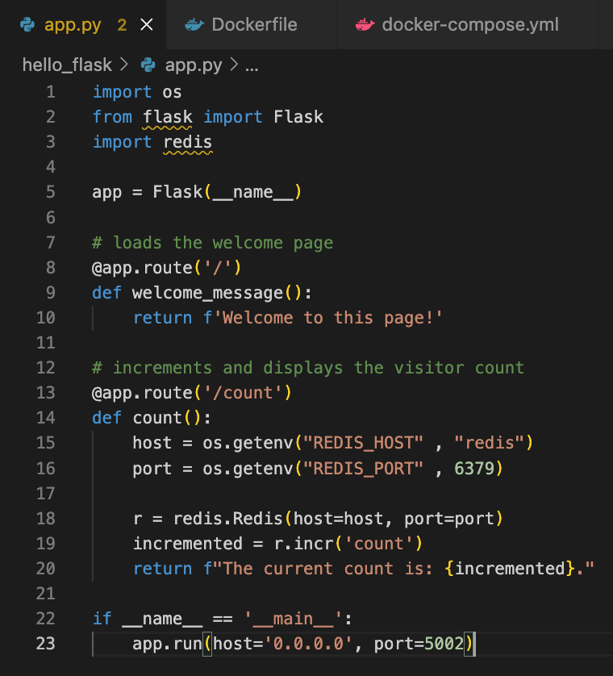
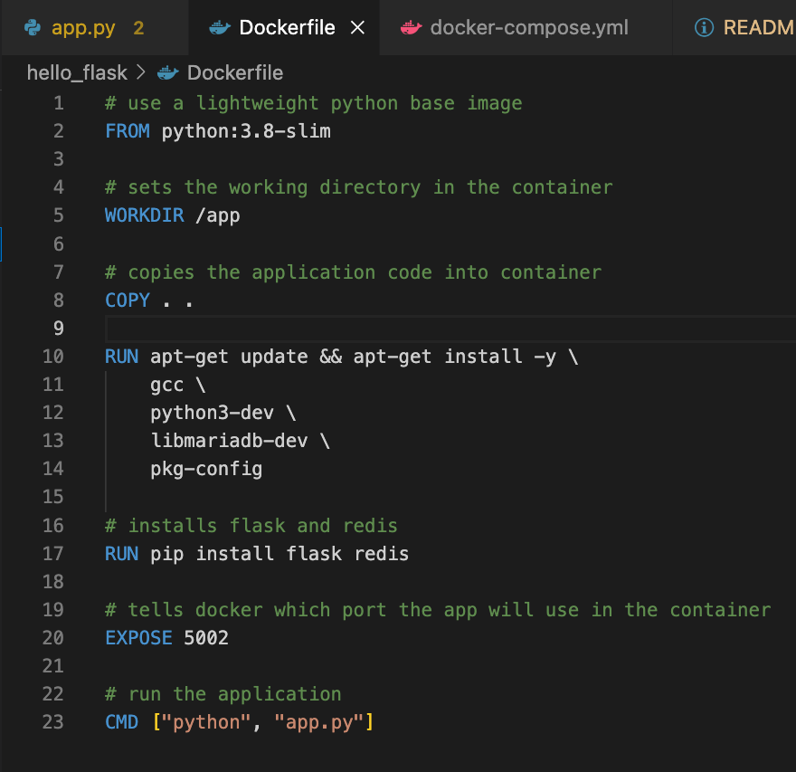
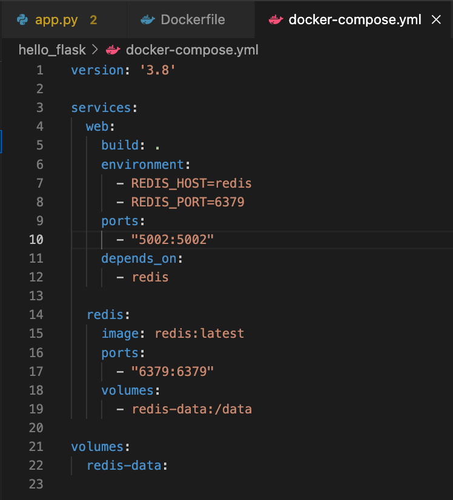
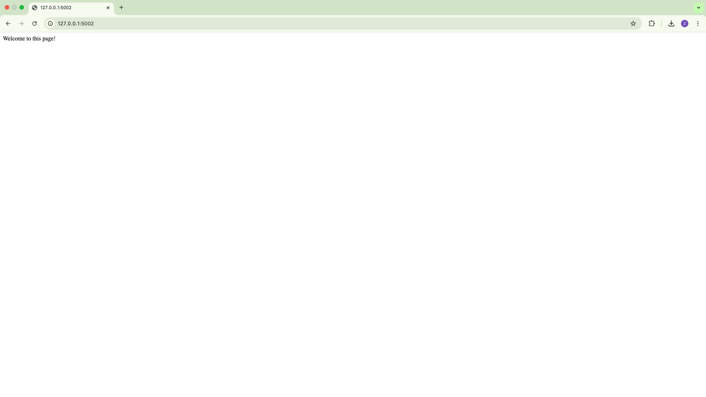
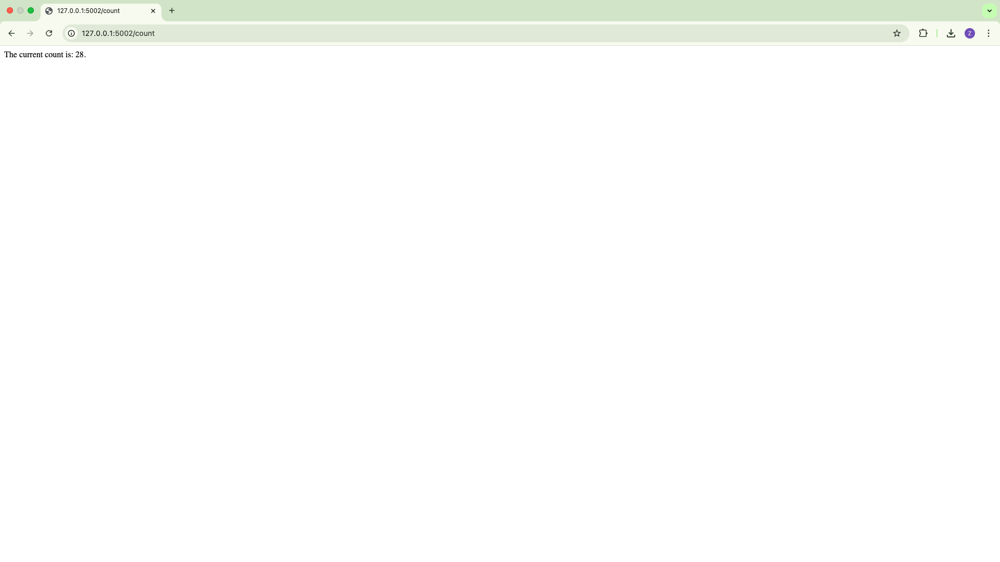

# Flask and Redis Multi Container Application

For this project, I created a small Flask web application that connects to a Redis database and then dockerised both services so they can run together using Docker and Docker Compose. The Flask app handles the web routes and visitor counter logic, while Redis stores the counter data across container restarts.

I built a small Flask app with two routes: “/” returns a simple welcome message, and “/count” shows a running visitor count. In “/count,” the app connects to Redis using the host and port from environment variables, then calls incr("count"), which creates the key if it doesn’t exist and increases its value by 1. Each refresh of the “/count” page increments the stored number and displays the new total.

I dockerised the Flask application by writing a Dockerfile that builds an image for it. I started with a lightweight base image called python:3.8-slim, which includes Python but keeps the image size small. I set the working directory to /app and copied all the project files into it so the container has access to the code. I installed a few required build tools and then used pip to install Flask and the Redis client library. I exposed port 5002 to show which port the app runs on inside the container. I then set the command to python app.py so the Flask server automatically starts when the container runs.

I used Docker Compose to run both the Flask app and Redis together as separate containers. In the docker-compose.yml file, I created a web service that builds from the current directory using the Dockerfile and maps port 5002 on my machine to 5002 inside the container so I can access the app in my browser. I set environment variables for the Redis host and port so the Flask app knows how to connect to the Redis service. I added a depends_on line to make sure Redis starts before the web container. I then created a redis service using the official redis:latest image, mapped port 6379 and attached a named volume at /data so the stored count is not lost when the container restarts.

I used the command `docker-compose up --build` to build the images and start both containers. Once everything was running, I opened the browser at http://localhost:5002 to view the Flask app and confirmed that the visit counter increased each time the page was refreshed.
